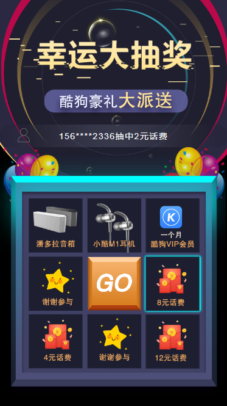

# vue-lucky-draw
移动端九宫格转盘抽奖vue组件，中奖的奖品数据由接口决定。  

## 效果图


### 抽奖
因为中奖的结果是后台返回的，所以要考虑转盘的最终停下来的位置必须是在对应后台返回结果的奖品的位置，也就是要模拟出这个中奖的过程（所以所谓的抽奖都是骗人的，嘿嘿）。先要写出移动的背景框对应的各个位置的css，然后动态切换class来使其呈现出转动效果。明白了过程就好写了。   

中间的按钮用的是css3的animation，我这个奖品是合在了一张图上，你也可以分开成8张小图，那样需要写更多的样式。
```javascript
// 抽奖
  handleStart() {
    if (this.isRuningLucky) {
      return Toast("正在抽奖中...");
    }
    if (isNaN(Number(this.initSpeed))) {
      return false;
    }
    this.speed = this.initSpeed;
    // 开始抽奖
    this.isRuningLucky = true;
    this.time = Date.now();
    this.drawAward();
    Toast("开始抽奖");
  },
  drawAward() {
    // 请求接口，模拟一个抽奖数据(假设请求时间为2s)
    setTimeout(() => {
      this.award = {
        id: "4"
      };
      console.log("返回的抽奖结果是", this.award);
    }, 2000);
    this.move();
  },
  move() {
    let timer = setTimeout(() => {
      this.current++;
      if (this.current > 7) {
        this.current = 0;
      }
      // 若抽中的奖品id存在，则开始减速转动
      if (this.award.id && (Date.now() - this.time) / 1000 > 2) {
        console.log("奖品出来了");
        this.speed += this.diff; // 转动减速
        
        // 若转动时间超过4秒，并且奖品id等于小格子的奖品id，则停下来
        if (
          (Date.now() - this.time) / 1000 > 4 &&
          this.award.id == this.awards[this.current].id
        ) {
          clearTimeout(timer);

          setTimeout(() => {
            this.isRuningLucky = false;
            // 这里写停下来要执行的操作（弹出奖品框）
            Toast(
              "您抽中的奖品是" + this.awards[this.current].name + ",奖品id是" + this.awards[this.current].id
            );
          }, 400);
          return;
        }

      // 若抽中的奖品不存在，则加速转动
      } else {
        if (this.speed >= 50) {
          this.speed -= this.diff; // 转动加速
        }
      }

      this.move();
    }, this.speed);
  },
```     

## 号码滚动
使用无序列表将号码列表（正常是从接口获取）循环出来，通过设置定时以及控制transition的属性，来达到无缝连接的效果。如果样式（li高度）改变的话，需要对定时器时间进行调节（控制下一个显示的时间）。   
```javascript
// 中奖名单滚动
  scroll() {
    this.animate = true;
    let timer = setTimeout(() => {
      this.list.push(this.list[0]);
      this.list.shift();
      this.animate = false;
    }, 500);
  }
```

可以clone项目 `npm i` , `npm run dev`，喜欢的话点个星吧^_^~


